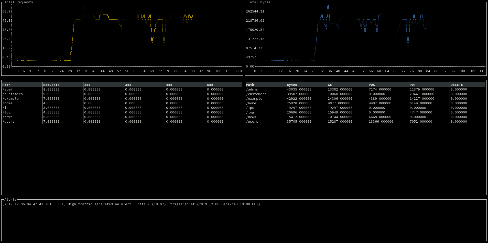

# loghound - common log file monitor

## Requirements

To be able to execute loghound, you need a system with go execution environment.
You can install go from [the golang official site](http://golang.org)

## Install & Run

Under `loghound` directory, first compile the binary:

```bash
% go build cmd/loghound/loghound.go

```

Then run with:

```bash
% ./loghound
```

Some parameters supported:

```bash
% ./loghound -h
Usage of ./loghound:
  -a int
    	interval to consider for alarm threshold (s) (default 120)
  -l string
    	common log format file to monitor (default "/tmp/access.log")
  -s int
    	stats interval generation (s) (default 2)
  -t int
    	alarm threshold (req/seq) (default 10)
```

You can generate some random traffic with `cmd/loghound/traffic.go`


```bash
% ./traffic -h
Usage of ./traffic:
  -l string
    	file to store logs (default "/tmp/access.log")
```


## Design

With loghound you can visualize log files in common log file format, visualize statistics and generate alarms.

When designing the application the main aspects considered were:

- Create an application with good performance, scalable and modular
- Depend on as few external packages as possible
- Create a nice user interface xD


The application is composed on some modules:

- broker: the broker module is responsible to create a pub/sub pipeline to communicate the other modules in the application. The pipeline support topic subscription, so each module can select with topics to follow.

- filemon: this module is the one that monitors the file, every time a new line is added, it creates a `common log format` entry, and sends it to the broker bus.

- stats: this module listen for log messages on the pipeline. Every time a new one arrives, it updates the counters in its cache. This counters will be used to generate statistics periodically (user defined) of some metrics. this stas will be sent to the message bus after being generated.

- alarms: this modules listen for statistic messages. It checks the number of requests generated and if the value increases a threshold (user defined) over a period of time (user defined) it will generate an alarm message and send it to the message bus. If the number of requests go down the threshold, a new alarm message will be generated to cancel the previous one.

- console: this module is responsible of generating a user interface to visualize the metrics and alarms generated by previous modules. For each path, we generate about 10 metrics.



## Improvements

The application is designed to be executed on a single machine, and monitor resources on the own machine.

I've tried to design it modular, so adding new elements should be easy and don't interfere with the existing ones. For example, new modules could be added to monitor different log formats, or different elements/protocols in the system (network traffic, cpu, memory, or other system resources). Regarding the alarms, new modules can be added to the existing one with different operations, like the max, median values (p50), p99, etc.

On the other hand, extending the application to monitor remote resources could be easy as well, for example creating new http or other modules to monitor external resources.

Also instead of using a local broker, we could create a module to connect to a remote one, so messages from multiple elements can be monitored using our console application.
